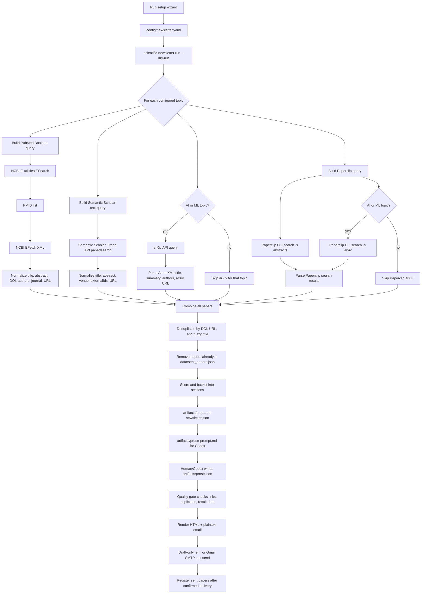

# APIs And Search Workflow

This page explains what Scientific Newsletter searches, which APIs it calls, and how results become a newsletter.

## Workflow Diagram



## Sources

Scientific Newsletter uses four discovery lanes.

| Source | What it is for | How it is queried | What comes back |
|---|---|---|---|
| PubMed / NCBI E-utilities | Peer-reviewed biomedical literature | `esearch.fcgi` finds PMIDs; `efetch.fcgi` retrieves XML records | PMID URL, title, abstract, journal, DOI, authors, publication date |
| Semantic Scholar Graph API | Broader scholarly search, especially AI and methods papers | `/graph/v1/paper/search` using topic keywords | Semantic Scholar URL, title, abstract, venue, external IDs/DOI, authors, date |
| arXiv API | Recent AI, ML, computational medicine, and preprints | `export.arxiv.org/api/query` with `search_query`, `max_results`, `sortBy=submittedDate` | Atom XML entries with title, summary, authors, published date, arXiv URL |
| Paperclip CLI | Full-text and broader biomedical search, PMC/preprints/arXiv/trials/regulatory when enabled | `paperclip --no-repo search -s abstracts ...` and AI-specific `-s arxiv ...` | Paperclip search records normalized into the same paper shape |

Relevant public docs:

- NCBI E-utilities: https://www.nlm.nih.gov/dataguide/eutilities/utilities.html
- Semantic Scholar API: https://api.semanticscholar.org/api-docs/graph
- arXiv API user manual: https://info.arxiv.org/help/api/user-manual.html
- Paperclip CLI help: run `paperclip --help` and `paperclip search -s pmc --help`

## Exact Query Shape

### PubMed

For each topic, the code takes up to the first eight keywords and builds a Boolean OR query:

```text
("keyword 1" OR "keyword 2" OR ... "keyword 8")
AND (YYYY/MM/DD:YYYY/MM/DD[Date - Publication])
```

Then it calls:

```text
https://eutils.ncbi.nlm.nih.gov/entrez/eutils/esearch.fcgi
```

with:

```text
db=pubmed
retmode=json
retmax=<max_results_per_topic>
sort=pub_date
term=<query>
```

`ESearch` returns PMIDs. The tool then calls:

```text
https://eutils.ncbi.nlm.nih.gov/entrez/eutils/efetch.fcgi
```

with:

```text
db=pubmed
retmode=xml
id=<comma-separated PMIDs>
```

The XML is parsed into normalized paper records.

### Semantic Scholar

For each topic, the code joins the first five keywords into a plain-text query:

```text
keyword1 keyword2 keyword3 keyword4 keyword5
```

Then it calls:

```text
https://api.semanticscholar.org/graph/v1/paper/search
```

with:

```text
query=<plain topic query>
limit=<max_results_per_topic, capped at 100>
fields=title,abstract,venue,url,authors,externalIds,publicationDate,year
```

If `SEMANTIC_SCHOLAR_API_KEY` is set, it is sent as the `x-api-key` header.

### arXiv

arXiv is used for AI or machine-learning topics. The code turns the first four keywords into:

```text
all:"keyword1" OR all:"keyword2" OR all:"keyword3" OR all:"keyword4"
```

Then it calls:

```text
https://export.arxiv.org/api/query
```

with:

```text
search_query=<arXiv query>
start=0
max_results=<max_results_per_topic, capped at 50>
sortBy=submittedDate
sortOrder=descending
```

The response is Atom XML. The tool extracts title, summary, authors, published date, and arXiv URL.

### Paperclip

Paperclip is first-class in the config:

```yaml
discovery:
  sources:
    paperclip: true
```

For each topic, the code runs:

```bash
paperclip --no-repo search -s abstracts "<topic keywords>" -n <max_results> --since <days_back>d --sort date
```

For AI or machine-learning topics, it also searches arXiv through Paperclip:

```bash
paperclip --no-repo search -s arxiv "<topic keywords>" -n <max_results> --since <days_back>d --sort date
```

Paperclip supports additional sources that advanced users can add later:

```bash
paperclip search -s pmc "topic"
paperclip search -s biorxiv "topic"
paperclip search -s medrxiv "topic"
paperclip search -s fda "drug or device"
paperclip search -s trials "condition intervention phase 3"
```

If Paperclip is not installed or authenticated, discovery continues with PubMed, Semantic Scholar, and arXiv. For non-interactive use, set `PAPERCLIP_API_KEY`.

## Clinician Research Digest Search Coverage

The default topics include a broad clinician research digest pattern: major trials, CNS oncology, radiation oncology, AI in medicine, general oncology, and a deliberate outside-the-comfort-zone medicine section.

### Top Papers

Used for scoring and surfacing major studies:

```text
randomized, phase 3, phase III, practice changing, overall survival,
progression-free survival, hazard ratio, clinical trial
```

### CNS Oncology

```text
brain, glioma, glioblastoma, meningioma, brain metastases, PCNSL,
spine, spinal metastases, SRS, radiosurgery, whole brain radiotherapy,
hippocampal avoidance, leptomeningeal, IDH, MGMT, neurocognitive
```

### Radiation Oncology

```text
radiotherapy, radiation therapy, SBRT, IMRT, VMAT, proton therapy,
brachytherapy, hypofractionation, adaptive radiotherapy, MR-linac,
FLASH radiotherapy, reirradiation, auto-segmentation, treatment planning,
oligometastatic
```

### AI In Medicine

```text
artificial intelligence, machine learning, deep learning, large language model,
LLM, foundation model, retrieval augmented generation, clinical decision support,
ambient clinical documentation, AI scribe, medical imaging foundation model,
radiology report generation, multimodal medical AI, AI agent, AI safety,
FDA artificial intelligence medical device
```

### General Oncology

```text
immunotherapy, checkpoint inhibitor, CAR-T, targeted therapy, chemotherapy,
antibody-drug conjugate, ADC, bispecific, NSCLC, SCLC, lung cancer,
breast cancer, colorectal cancer, prostate cancer, melanoma, lymphoma, myeloma,
pembrolizumab, nivolumab, durvalumab
```

### General Medicine / Outside The Comfort Zone

```text
cardiovascular, diabetes, obesity, GLP-1, semaglutide, tirzepatide,
evolocumab, infectious disease, public health, humanitarian health, conflict,
forced displacement, neuroscience, gene therapy, CRISPR, vaccine, HPV vaccine,
digital medicine oversight
```

## How Results Are Normalized

Every source is converted into the same record shape:

```json
{
  "title": "Original paper title",
  "original_title": "Original paper title",
  "abstract": "Abstract or summary text",
  "journal": "Journal or source label",
  "doi": "10.xxxx/...",
  "url": "https://...",
  "published": "YYYY-MM-DD",
  "authors": ["First Author", "Second Author"],
  "source": "PubMed | Semantic Scholar | arXiv | Paperclip"
}
```

That common shape lets the rest of the workflow ignore which API found the paper.

## Deduplication And Registry

Deduplication happens twice:

1. During discovery, repeated papers from multiple sources are removed.
2. During preparation, papers already present in `data/sent_papers.json` are excluded.

Duplicate checks use DOI, canonical URL, and fuzzy title matching. This matters because the same article can appear as a PubMed record, journal DOI page, Semantic Scholar page, and Paperclip result.

## Scoring And Bucketing

After deduplication, papers are scored. The score favors:

- Major journals such as NEJM, Lancet, JAMA, Nature, Science, JCO.
- Trial/result language such as randomized, phase III, survival, hazard ratio, confidence interval, sensitivity, specificity.
- DOI and abstract availability.

The highest-scoring papers fill `Top Papers`. Remaining papers are assigned to the configured topic sections by keyword match. Unused high-scoring papers can appear in Rapid Fire.

## Where To Customize

Edit `config/newsletter.yaml`:

```yaml
topics:
  - name: "Cardio-Oncology"
    keywords: ["cardio-oncology", "anthracycline", "immune checkpoint myocarditis", "heart failure"]
    min_items: 1
    max_items: 4
```

Edit source switches:

```yaml
discovery:
  sources:
    pubmed: true
    semantic_scholar: true
    arxiv: true
    paperclip: true
```

Use `paperclip: true` when Paperclip is installed and authenticated. Keep it enabled if you want broader abstract coverage and better AI/preprint catchment.
