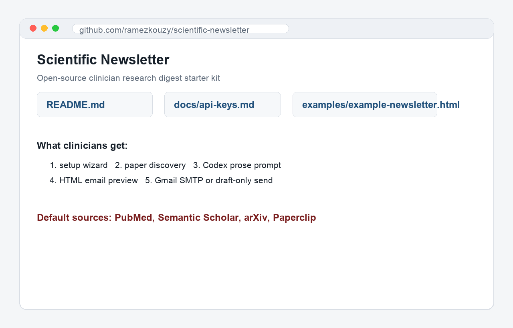
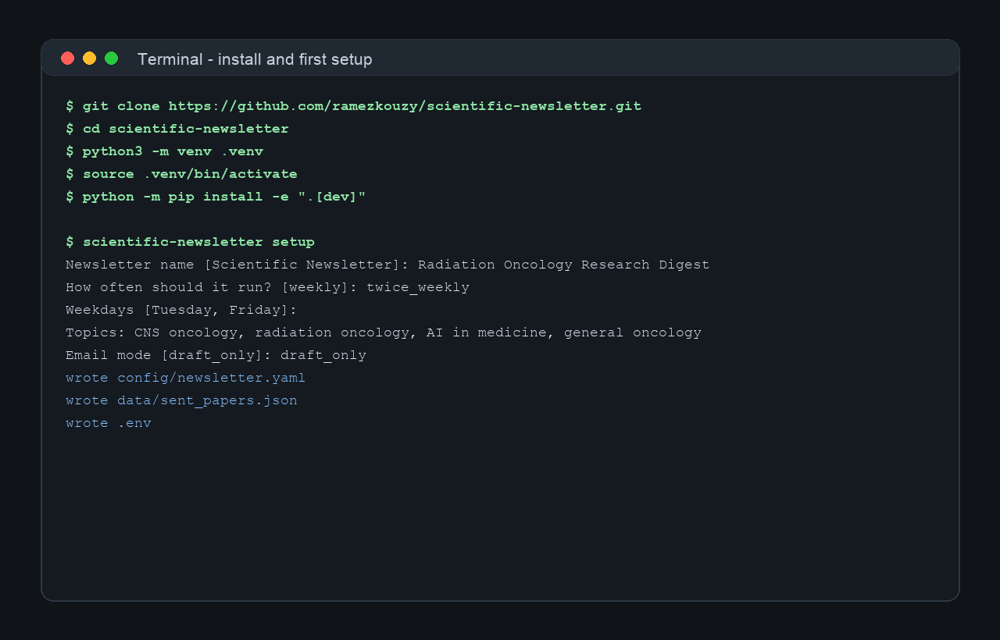
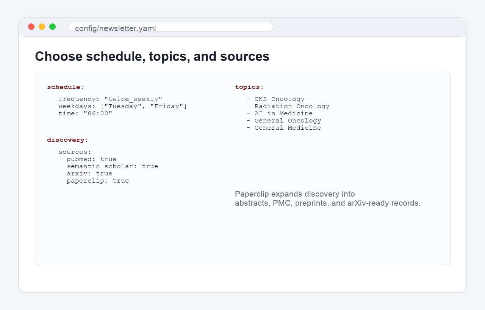
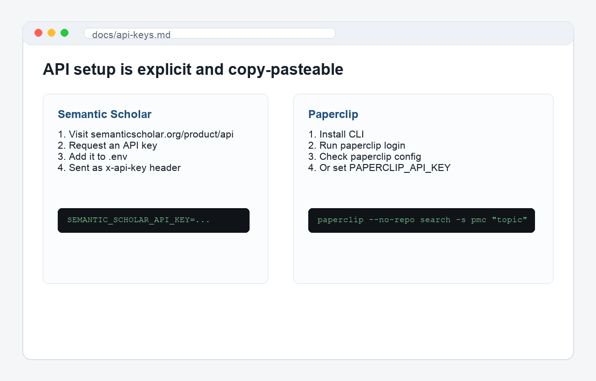
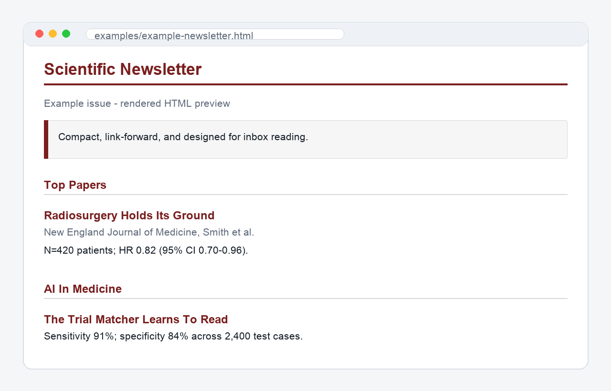
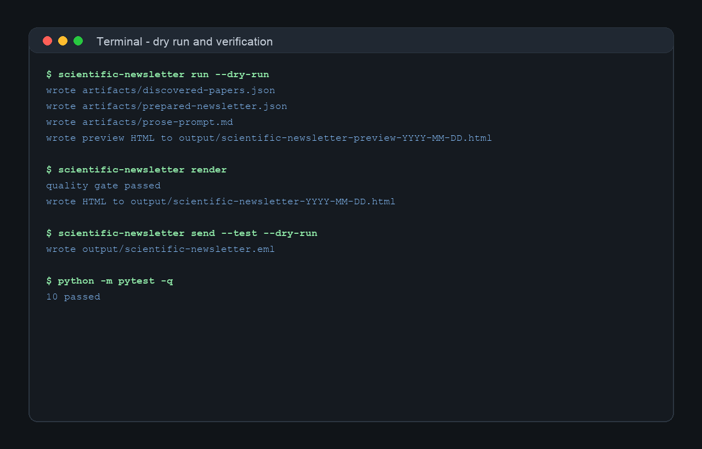

# BeamPath Step-By-Step: Launch A Scientific Newsletter With Codex

This is a post-ready walkthrough for clinicians who want to run their own scientific newsletter using the open-source Scientific Newsletter starter kit.

Repo: https://github.com/ramezkouzy/scientific-newsletter

## What This Builds

Scientific Newsletter is a configurable workflow for turning recent papers into a reviewed email digest. It searches the literature, deduplicates papers, groups them by topic, prepares a Codex-ready writing prompt, renders an HTML email, and supports either draft-only review or Gmail SMTP sending.



## 1. Open The Repo In GitHub Or Codex

Start with the GitHub repository:

```text
https://github.com/ramezkouzy/scientific-newsletter
```

If you use ChatGPT with Codex, import the repository there. Codex can run the setup wizard, inspect the generated files, help draft the first issue, and run the tests.

If you prefer local setup, clone it:

```bash
git clone https://github.com/ramezkouzy/scientific-newsletter.git
cd scientific-newsletter
```

## 2. Install And Run First Setup

Create a virtual environment and install the package:

```bash
python3 -m venv .venv
source .venv/bin/activate
python -m pip install -e ".[dev]"
```

Then run:

```bash
scientific-newsletter setup
```

The wizard asks for the newsletter name, sender email, test recipient, how often it should run, weekday/time, time zone, topics, tone, email mode, and whether review is required before sending.



Start in `draft_only` mode. That creates an email draft file instead of sending anything.

## 3. Configure Topics And Sources

The setup wizard writes:

```text
config/newsletter.yaml
.env
data/sent_papers.json
```

The main file to edit is `config/newsletter.yaml`.



The default source configuration is:

```yaml
discovery:
  sources:
    pubmed: true
    semantic_scholar: true
    arxiv: true
    paperclip: true
```

Default topic coverage includes:

- Top papers and major trials
- CNS oncology
- Radiation oncology
- AI in medicine
- General oncology
- General medicine / outside-the-comfort-zone papers

You can replace these with your own specialty areas.

## 4. Add API Keys

You can run the first preview without paid keys. For better coverage, add Semantic Scholar and Paperclip.



### Semantic Scholar

1. Open https://www.semanticscholar.org/product/api.
2. Click **Request an API Key**.
3. Describe your use case:

```text
I am using the Semantic Scholar Academic Graph API for a clinician-facing
scientific newsletter tool. The tool searches recent papers by configured
clinical/scientific topics, retrieves title/abstract/venue/DOI/author metadata,
deduplicates records, and prepares a human-reviewed research digest.
```

4. Add the key to `.env`:

```bash
SEMANTIC_SCHOLAR_API_KEY=replace_with_your_semantic_scholar_key
```

### Paperclip

Paperclip can search open biomedical full-text corpora and preprints in an AI-ready structure.

Install:

```bash
curl -fsSL https://paperclip.gxl.ai/install.sh | bash
```

Or:

```bash
pip install https://paperclip.gxl.ai/paperclip.whl
paperclip setup
```

Authenticate:

```bash
paperclip login
paperclip config
```

For scheduled or non-interactive use, put this in `.env`:

```bash
PAPERCLIP_API_KEY=replace_with_your_paperclip_key
```

The current release uses Paperclip for search/discovery. A later enrichment step can read full Paperclip files such as `/papers/<id>/content.lines` before prose generation.

## 5. Preview The Newsletter Format

The repo includes an example HTML file:

```text
examples/example-newsletter.html
```



The format is designed for inbox reading: serif typography, linked paper headlines, journal/author lines, concise interpretation, and visible statistics.

## 6. Run A Dry Preview

Run:

```bash
scientific-newsletter run --dry-run
```

This writes:

```text
artifacts/discovered-papers.json
artifacts/prepared-newsletter.json
artifacts/prose-prompt.md
artifacts/prose.example.json
output/scientific-newsletter-preview-YYYY-MM-DD.html
```

Open `artifacts/prose-prompt.md` in Codex and ask it to write `artifacts/prose.json`.

Then render:

```bash
scientific-newsletter render
```



## 7. Send A Test Draft

Start with a draft:

```bash
scientific-newsletter send --test --dry-run
```

This writes:

```text
output/scientific-newsletter.eml
```

Open it and review the links, formatting, and interpretation.

Only after review should you switch to Gmail SMTP:

```yaml
email:
  mode: "gmail_smtp"
```

Then send a test email:

```bash
scientific-newsletter send --test
```

## 8. Register Sent Papers

After confirmed delivery:

```bash
scientific-newsletter register --edition "Scientific Newsletter YYYY-MM-DD"
```

This updates:

```text
data/sent_papers.json
```

The registry prevents repeat papers in future issues by checking DOI, URL, and fuzzy title similarity.

## 9. Safety Checklist

Before sending a real issue:

- Run `python -m pytest -q`.
- Run `scientific-newsletter run --dry-run`.
- Review `artifacts/prepared-newsletter.json`.
- Verify every paper link.
- Verify every statistic against the paper.
- Send to yourself first.
- Register sent papers only after confirmed delivery.

## 10. Why This Matters

Most clinicians do not need another stream of alerts. They need a reliable way to turn the literature into a reviewed, readable, specialty-specific digest. This project handles the plumbing so the clinician can focus on judgment: what is worth reading, what is practice-changing, and what should be ignored.
